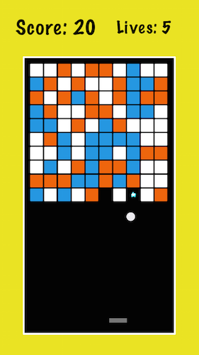
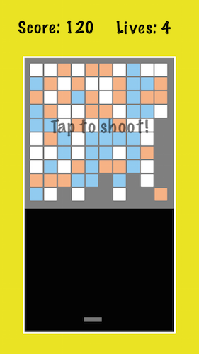

# Blocs - A simple iOS game

This is my first attempt at making a game without a tutorial. 
It has a few bugs that I'm working on, but it's mostly completed at this point.

Screenshots:

Now on to the next challenge!

I'm uploading this code to Github for a few reasons:
    
1. I want to keep track of my games that I create
2. I want others to be able to look at it as an example (not that it's amazing or anything lol, but I did try my best!)